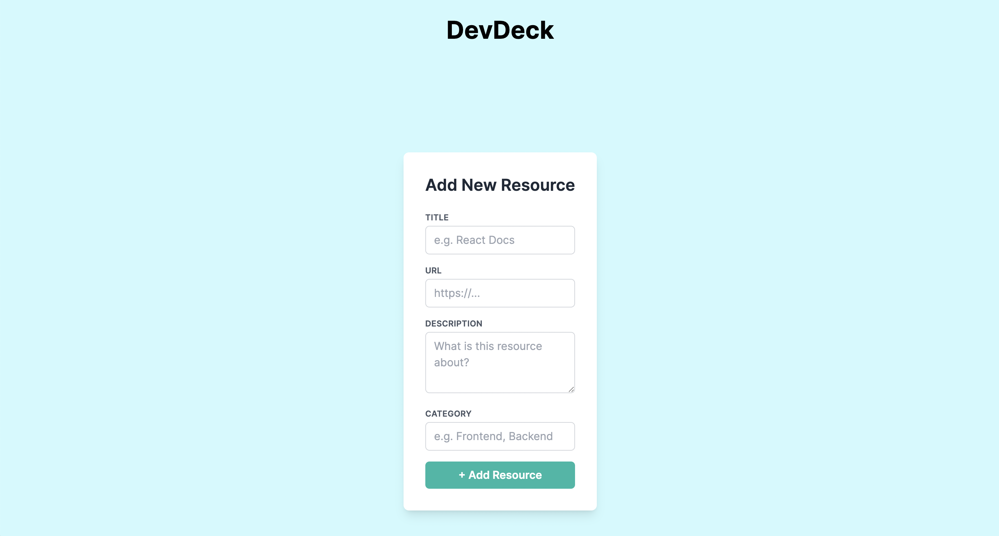

# DevDeck 🃏

DevDeck is a simple and elegant web app for organizing your favorite development resources — from documentation to articles and tools — in one accessible place.

<p align="center">
  
</p>

## ✨ Features

- Add resources with title, URL, description and category
- Responsive design (desktop & mobile)
- Built with accessibility and developer experience in mind

---

## 🛠️ Stack

- **Framework**: [Next.js](https://nextjs.org/)
- **Language**: TypeScript
- **Styling**: Tailwind CSS
- **Testing**: Vitest + React Testing Library *(planned)*
- **Linting/Formatting**: ESLint + Prettier

---

## 🚀 Getting Started

```bash
git clone https://github.com/your-username/devdeck.git
cd devdeck
npm install
npm run dev
```
## 📁 Project Structure
``` tree
.
├── app/              # Next.js app directory (pages, layouts)
├── components/       # Reusable UI components
├── features/         # Domain-specific features (e.g. resources)
├── hooks/            # Custom React hooks
├── lib/              # Utility functions and helpers
├── styles/           # Global and shared Tailwind styles
├── tests/            # Unit & integration tests (coming)
└── public/           # Static assets
```
## 🧠 Author
Made with 💙 by @mariaalmeida-dev
